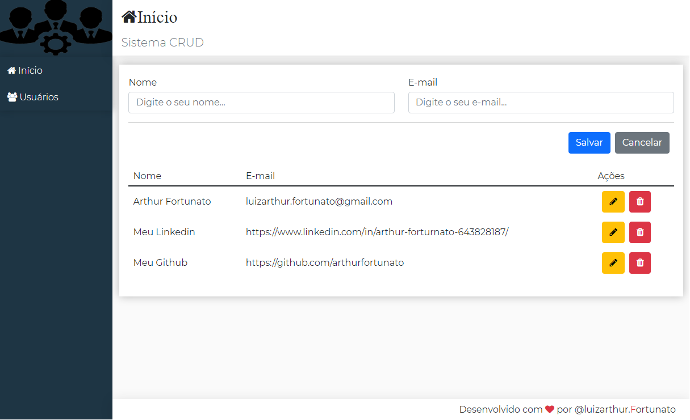

<h1 align="center">
    
</h1>

<p align="center">
  
</p>

## 💻 Projeto CRUD (Create, Read, Update e Delete)

Projeto desenvolvido na plataforma da **[Udemy](https://www.udemy.com/)**, realizado sobre a mentoria do professor Leonardo Leitão.

<p>Tem o Objetivo de criar um sistema de cadastro utilizando react e json-server.</p>


<p align="center">
  
</p>


## 🚀 Tecnologias

 >>[Node.js](https://nodejs.org/en/)   >>[React](https://reactjs.org) >>[JSON Server](https://www.npmjs.com/package/json-server) >>[React-Lottie](https://www.npmjs.com/package/react-lottie)  >>[Axios](https://www.npmjs.com/package/axios) >>[Styled-Component](https://styled-components.com/docs/basics)
 >>[Font-Awesome](https://www.npmjs.com/package/font-awesome)

## 📝 Licença 

Esse projeto está sob a licença MIT. Veja o arquivo [LICENSE](LICENSE.md) para mais detalhes.

---

```bash

# Clone o repositório
$ git clone https://github.com/arthurfortunato/CRUD.git

# Acesse a pasta do backend do projeto no prompt de comando
$ cd backend

# Instale as dependências
$ npm install 

# Execute o script "start"
$ npm start

# O projeto inciará na porta: 3001 - acesse http://localhost:3001/users 

# Acesse a pasta do frontend do projeto no prompt de comando
$ cd frontend

# Instale as dependências
$ npm install 

# Execute o script "start"
$ npm start

# O projeto inciará na porta: 3000 - acesse http://localhost:3000 
